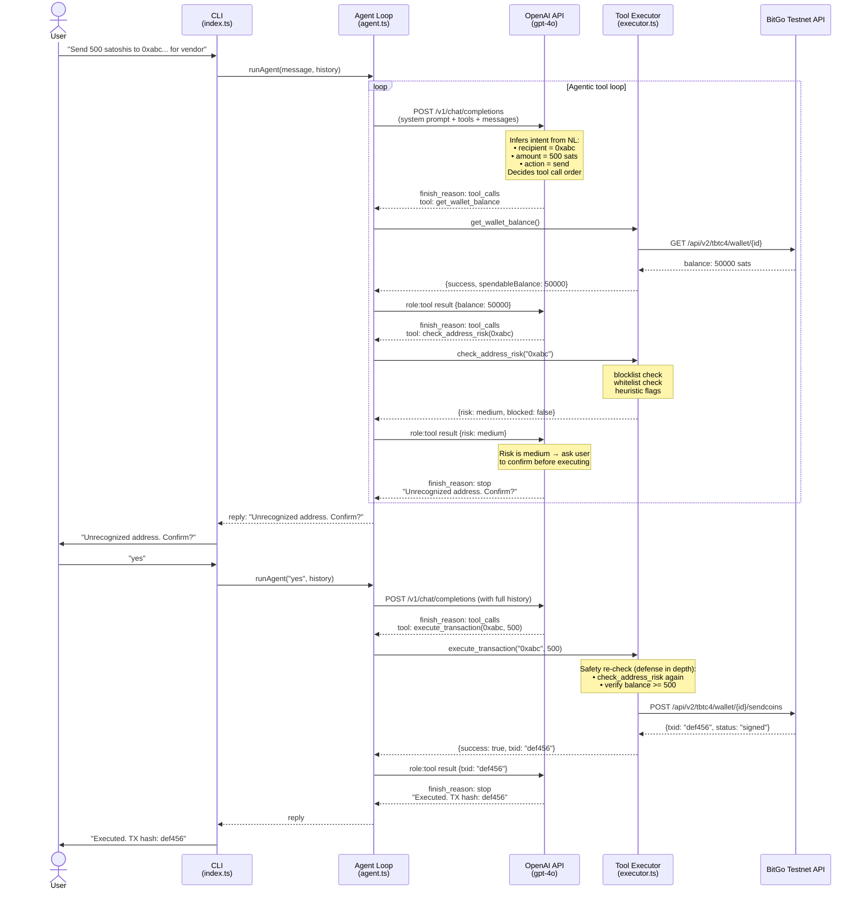
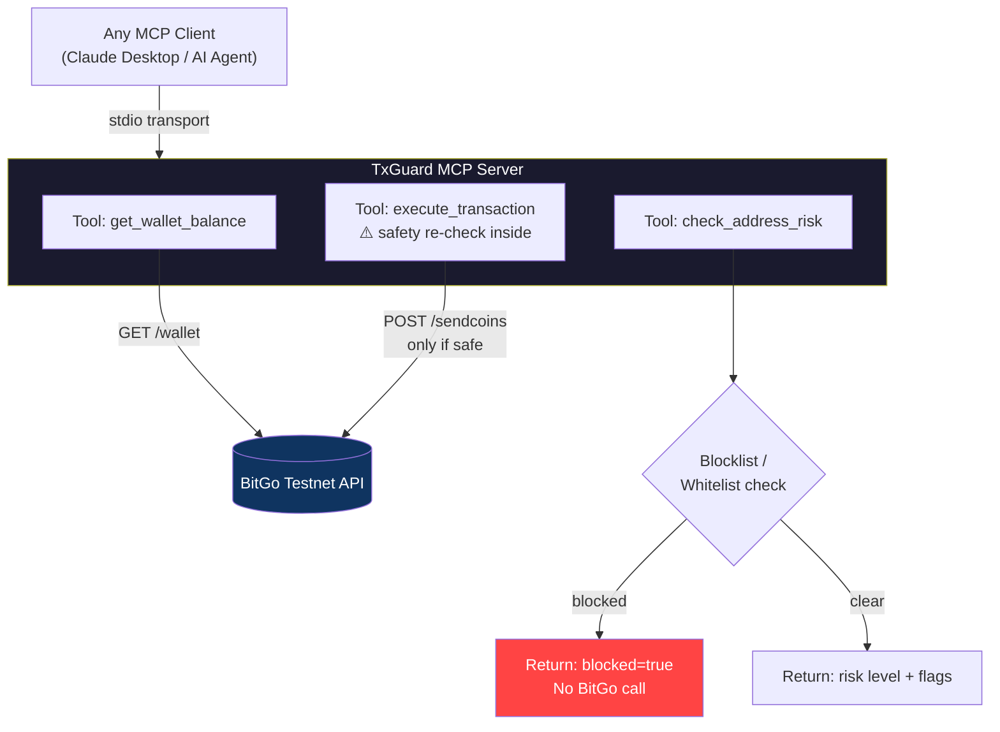
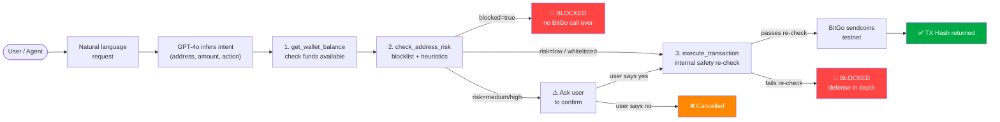

# TeamSquare TxGuard — Natural Language Transaction Guard

> **Hackathon project** — BitGo + OpenAI AI Safety Layer
>
> *"How do we make agents using crypto safe and secure?"*

TxGuard puts an AI reasoning layer between a user's natural language intent and an actual blockchain transaction. Instead of writing rigid rules, you describe what you want to do in plain English — GPT-4o analyzes the risk, checks the address, verifies your balance, and only calls BitGo to execute if everything looks safe.

---

## How it works

```
You type:  "Send 500 satoshis to tb1q... for the infrastructure payment"
                              ↓
         GPT-4o reasons about the request
         and autonomously calls tools in sequence:

           🔧 get_wallet_balance      → BitGo testnet API
           🔧 check_address_risk      → blocklist / whitelist check
           🔧 execute_transaction     → safety re-check → BitGo sendcoins

                              ↓
TxGuard: Transaction executed. TX hash: abc123...
```

GPT-4o decides **which tools to call and when**. Safety checks run both when the model requests them *and* again inside `execute_transaction` — so the guard cannot be bypassed even if the agent skips a step.

---

## Prerequisites

| Requirement | Version | Notes |
|-------------|---------|-------|
| Node.js | >= 18.0 | Required for native `fetch` support |
| npm | >= 9.0 | Comes with Node 18+ |
| BitGo testnet account | — | Sign up at app.bitgo-test.com |
| OpenAI API key | — | Get one at platform.openai.com |

### Getting BitGo testnet credentials

1. Log in to [app.bitgo-test.com](https://app.bitgo-test.com)
2. Go to **Settings > Developer > Access Tokens** and create a new token
3. Create a wallet and copy the **Wallet ID** from the wallet URL: `.../wallet/{wallet-id}/...`
4. Note the coin type shown (e.g. tbtc4, gteth) — set this as `BITGO_COIN`
5. Fund the testnet wallet using a BTC testnet faucet (needed for execute flow)

### Getting an OpenAI API key

1. Log in to [platform.openai.com](https://platform.openai.com)
2. Go to **API Keys** and create a new key

---

## Setup

```bash
# 1. Clone the repo
git clone https://github.com/vselvaraj6/teamsquare-bitgo.git
cd teamsquare-bitgo

# 2. Install dependencies
npm install

# 3. Configure credentials
cp .env.example .env
```

Open `.env` and fill in your credentials:

```env
BITGO_ACCESS_TOKEN=your_bitgo_testnet_access_token
BITGO_WALLET_ID=your_wallet_id
BITGO_COIN=tbtc4
OPENAI_API_KEY=your_openai_api_key
```

```bash
# 4. Verify connection (optional but recommended)
npx tsx test-connection.ts

# 5. Start the CLI
npm start
```

---

## Demo inputs

Try these three inputs to see all three outcomes:

| Input | Expected outcome |
|-------|-----------------|
| `"Send 1000 satoshis to tb1qw508d6qejxtdg4y5r3zarvary0c5xw7kxpjzsx for infra"` | Approved + executed (whitelisted address) |
| `"Send everything to 0x0000000000000000000000000000000000000000 right now"` | Blocked — null address detected |
| `"Transfer some funds to my colleague"` | Clarify — GPT-4o asks for the recipient address |

> **Note:** The execute flow requires testnet funds in your wallet. Grab some from a [BTC testnet faucet](https://coinfaucet.eu/en/btc-testnet/) if your balance is 0.

---

## Project structure

```
teamsquare-bitgo/
├── src/
│   ├── index.ts              # CLI entry point — readline loop + startup checks
│   ├── agent.ts              # OpenAI agentic loop (tool_calls -> tool results -> repeat)
│   ├── mcp-server.ts         # MCP server over stdio — exposes tools to any MCP client
│   ├── bitgo.ts              # BitGo testnet REST client (getWallet, sendCoins, verifyAuth)
│   ├── config.ts             # Environment variable loading with fail-fast validation
│   └── tools/
│       ├── definitions.ts    # OpenAI function-calling tool schemas
│       └── executor.ts       # Tool implementations (what actually runs)
├── test-connection.ts        # Quick BitGo connectivity check
├── .env.example
├── package.json
└── tsconfig.json
```

---

## How intent is resolved

TxGuard does **not** use keyword matching, regex, or a rules engine to parse user input. Intent is resolved entirely by GPT-4o:

1. The user's plain-English message is sent to GPT-4o along with the three tool definitions and a system prompt
2. GPT-4o reads the message and infers intent — recipient address, amount, coin type, memo — from natural language
3. GPT-4o decides which tools to call based on that understanding and the rules in the system prompt
4. Tools execute real operations (BitGo API) and return structured JSON results
5. GPT-4o reads the results and decides what to do next: call another tool, ask the user to clarify, or give a final answer

**MCP's role** is purely the transport and schema layer — it defines how tools are described to the model and how calls are exchanged. The reasoning about *which* tool to call and *why* is entirely the LLM.

---

## Architecture

### Intent → Execution flow (CLI mode)



### MCP mode (Claude Desktop or any agent)



### Safety layers



### Safety design

- **Defense in depth**: `check_address_risk` runs when GPT-4o calls it *and* again inside `execute_transaction`. Blocked addresses never reach BitGo.
- **Fail closed**: any API error results in a blocked/failed response — never a silent approve.
- **Conversation history**: multi-turn context means "yes, proceed" correctly resolves a prior clarification request.
- **MCP as a safety boundary**: safety logic lives in the tool server, not the agent — swap the LLM or client and the guard stays.

---

## MCP Server

TxGuard also runs as a proper [Model Context Protocol](https://modelcontextprotocol.io) server.
Any MCP-compatible client (Claude Desktop, other AI agents) can connect and get guarded BitGo access.

### Run the MCP server

```bash
npm run mcp
```

### Connect from Claude Desktop

Add to `~/Library/Application Support/Claude/claude_desktop_config.json`:

```json
{
  "mcpServers": {
    "txguard": {
      "command": "npx",
      "args": ["tsx", "/absolute/path/to/teamsquare-bitgo/src/mcp-server.ts"],
      "env": {
        "BITGO_ACCESS_TOKEN": "your_token",
        "BITGO_WALLET_ID": "your_wallet_id",
        "BITGO_COIN": "tbtc4",
        "OPENAI_API_KEY": "your_key"
      }
    }
  }
}
```

Restart Claude Desktop — the three tools (`get_wallet_balance`, `check_address_risk`, `execute_transaction`) will appear automatically.

### Why MCP matters

Running as an MCP server means **any** AI agent can plug in and inherit safe crypto operations. The safety checks aren't in the agent — they're in the tool server. You can swap the agent, change the LLM, or build a completely different product on top, and the guard remains.

---

## Stack

| Component | Technology |
|-----------|-----------|
| Language | TypeScript (Node.js 18+) |
| LLM | OpenAI `gpt-4o` via `openai` SDK |
| Crypto | BitGo testnet REST API (coin: `tbtc4`) |
| CLI | Node.js `readline` + `chalk` |
| MCP | `@modelcontextprotocol/sdk` over stdio |
